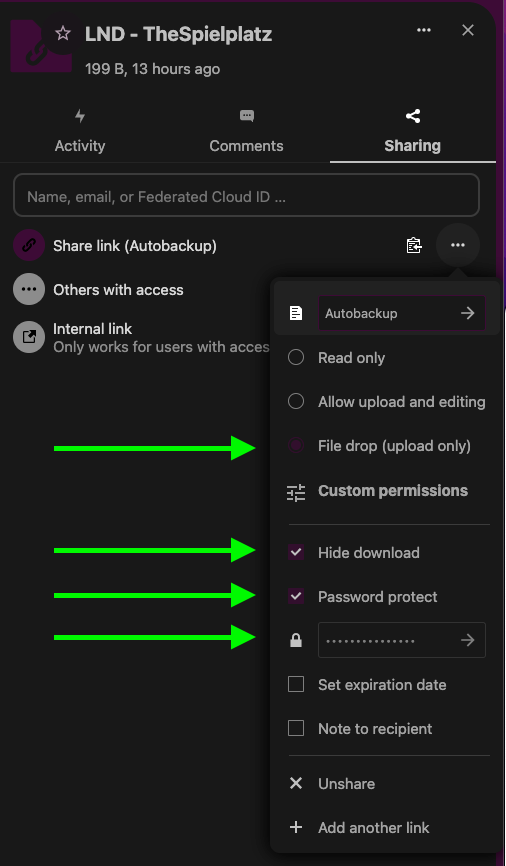

# Nextcloud Backuper
_by [#sathoshiengineeringcrew](https://satoshiengineering.com/)_

[](LICENSE)

A simple container to backup "stuff" to a nextcloud public share.

## How to use it

### 2. Create a nextcloud share

Create a share and:
- Set it to file drop "upload only" ... so no one can accidently look into it
- Hide download
- Optional: Set a password (_recommended_)

[](LICENSE)

## Notes

### Username & Password Access

I have not implemented or tested it, but it could work like this

```
NEXTCLOUD_SHARE=<USERNAME HERE>
NEXTCLOUD_PWD=<PASSWORD HERE>
NEXTCLOUD_HOST=<THIS WONT WORK>
```

Fork the code for the target like 
```
https://nextcloud.sourserver.com/nextcloud/remote.php/dav/files/<USERNAME>/
```
